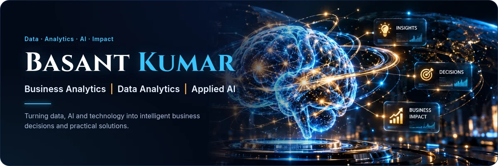
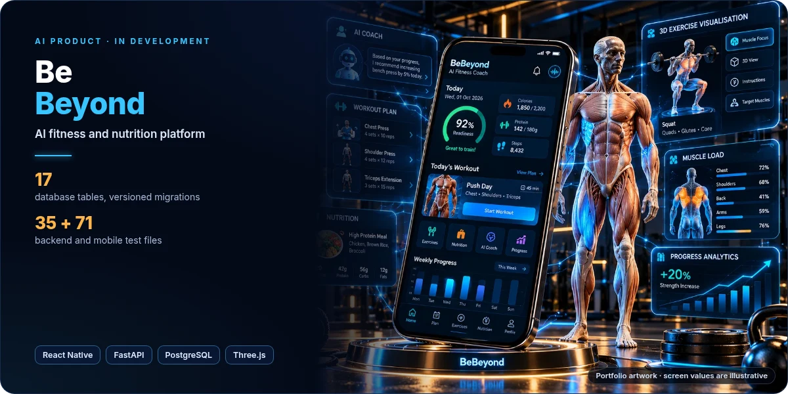
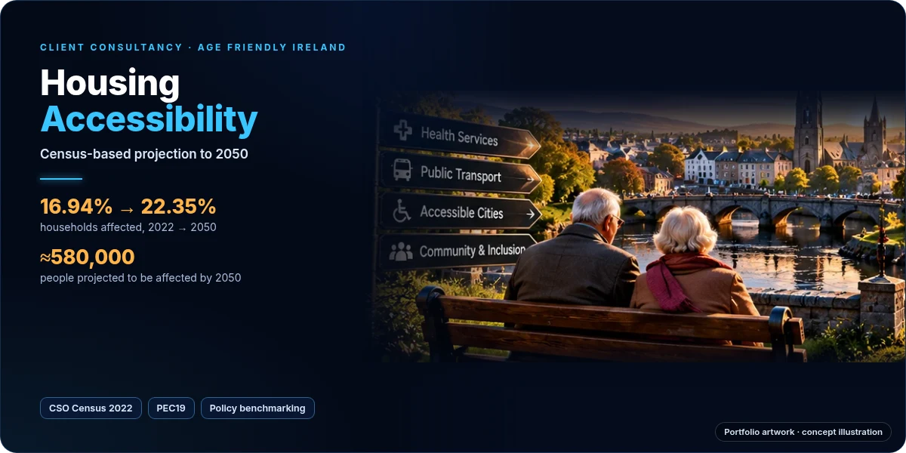
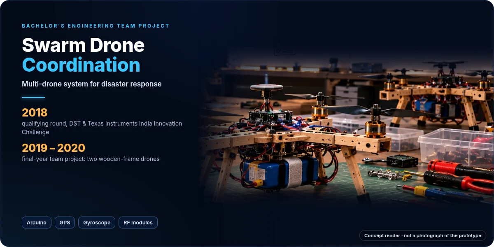

  

<h3 align="center">Business Analytics &nbsp;|&nbsp; Data Analytics &nbsp;|&nbsp; Applied AI</h3>

MSc Business Analytics (Maynooth University, award pending) with an electronics engineering background. I frame the problem with stakeholders, get the data into a state worth trusting, model it, and turn the result into something people can use.

  <a href="https://basant-kumar-portfoli.netlify.app/"><b>Portfolio</b></a> &nbsp;·&nbsp;
  <a href="https://www.linkedin.com/in/basantsingh-/"><b>LinkedIn</b></a> &nbsp;·&nbsp;
  <a href="mailto:basantsingh607@gmail.com"><b>Email</b></a> &nbsp;·&nbsp;
  <a href="https://github.com/basant-kumarr?tab=repositories"><b>Repositories</b></a>

  <b>Recruiters and hiring managers:</b> <a href="#featured-projects">explore my work ↓</a> 
  Celbridge, Co. Kildare, Ireland · open to Business Analyst, Data Analyst, BI Analyst and AI or Product Analyst roles

---

## Professional overview

- **Engineering foundation.** BEng in Electronics & Telecommunication Engineering, including a two-drone final-year team project.
- **Industry R&D.** At Bajaj Electricals I analysed IoT sensor data, built KPI reporting, applied forecasting and prepared gap analyses for AI and IoT solutions.
- **Research.** As a Graduate Research Assistant at Maynooth University I built automated reporting dashboards in Python, R and Tableau, and analysed interviews with HR leads, CEOs and senior managers.
- **Business analytics.** MSc Business Analytics at Maynooth University: programme completed in 2026, award pending.
- **What I bring.** Business analysis, data visualisation, forecasting and applied machine learning, plus the product engineering to make results usable.

---

## Featured projects

### BeBeyond · AI fitness and nutrition platform

A training, nutrition and coaching app in which a deterministic engine owns every number and a language model may only explain decisions, never make them.

- **Problem:** fitness advice that sounds confident without saying why, or how certain it is.
- **My role:** designed and built it end to end: exercise ontology, readiness and recommendation engines, FastAPI backend, React Native app.
- **Implemented:** muscle load and readiness with confidence tiers, a recommendation engine that carries its evidence, a nutrition engine, a 3D anatomy view. Camera form analysis runs on simulated input; wearable adapters are scaffolded.
- **Stack:** React Native · Expo · TypeScript · FastAPI · PostgreSQL · Three.js

**[Read the BeBeyond showcase →](projects/bebeyond/README.md)** &nbsp;Private repository · in active development

### Fraud Detection · explainable XGBoost classifier

An MSc team project that compares a logistic regression baseline with a tuned XGBoost model on a severely imbalanced synthetic dataset (0.4% fraud), and explains its decisions with SHAP.

- **My role:** feature engineering, XGBoost tuning, SHAP analysis and the Gradio demo.
- **Result:** 496 of 644 fraud cases caught on the hold-out set, against 59 for the baseline, with 11 false alerts.
- **Stack:** Python · XGBoost · scikit-learn · SHAP · Gradio

**[Project write-up →](https://github.com/basant-kumarr/fraud-detections-xgboost)** &nbsp;·&nbsp; [Live dashboard](https://fraud-detection-xgboost.netlify.app/)

### Housing Accessibility · client project for Age Friendly Ireland

A four-person consultancy project that estimates how many Irish households will include someone who struggles with stairs, projects it to 2050, and benchmarks housing policy in Ireland, Australia, Sweden and Denmark.

- **My role:** Business Analytics Consultant. I chose the prevalence × projection method and built the dashboard that presents it.
- **Result:** 16.94% of households in 2022, projected to 22.35% by 2050; five policy recommendations delivered to the client.
- **Stack:** CSO Census 2022 · CSO PEC19 projections · HTML, CSS, JavaScript and SVG

**[Project write-up →](https://github.com/basant-kumarr/housing-accessibility-ireland)** &nbsp;·&nbsp; [Live dashboard](https://age-friendly-ireland.netlify.app/) &nbsp;·&nbsp; [Dashboard source](https://github.com/basant-kumarr/ireland-stair-accessibility-dashboard)

### Sales Demand Forecasting · ARIMA vs Prophet

Two time-series models built in R and compared like for like, to show which suits which kind of product demand.

- **Method:** decomposition, ADF and ACF/PACF diagnostics; Auto ARIMA and Prophet; rolling-window validation on RMSE, MAE and MAPE.
- **Finding:** Prophet did better on strongly seasonal series with holiday effects; ARIMA on stationary, trend-driven series.
- **Stack:** R · forecast · prophet · dplyr · ggplot2

**[Project write-up →](https://github.com/basant-kumarr/sales-demand-forecasting)**

---

## Bachelor's project: Swarm Drone Coordination

An engineering team project exploring how two drones could be coordinated through one control approach to support disaster response.

- **2018:** qualifier in the **qualifying round** of the DST & Texas Instruments India Innovation Challenge Design Contest, anchored by NSRCEL, IIM Bangalore.
- **2019 – 2020:** continued as the **Bachelor's final-year team project**: two drones on simple wooden frames with Arduino-based control, GPS, a gyroscope, RF modules and battery monitoring.

**[Read the Swarm Drone showcase →](projects/swarm-drone-coordination/README.md)**

---

## Technical skills

- **Programming and data analysis:** Python · SQL · R · Excel · Power Query · MySQL  
  Used in: Fraud Detection, Sales Forecasting, research reporting
- **Business intelligence and visualisation:** Power BI · Tableau · ggplot2 · dashboard design  
  Used in: Research dashboards, Age Friendly Ireland and fraud dashboards
- **Machine learning and forecasting:** XGBoost · scikit-learn · SHAP · model evaluation · ARIMA · Prophet  
  Used in: Fraud Detection, Sales Forecasting
- **Business analysis and delivery:** Requirements · stakeholder management · KPI definition · process improvement · As-Is / To-Be · gap analysis · supply chain analytics · project management  
  Used in: Bajaj Electricals, Age Friendly Ireland
- **Software and APIs:** FastAPI · PostgreSQL · React Native · TypeScript · APIs · Git and GitHub  
  Used in: BeBeyond
- **IoT and engineering tools:** IoT · Arduino · GPS · RF modules · MATLAB · CAD  
  Used in: Bajaj Electricals, Swarm Drone Coordination

---

## Experience

**Graduate Research Assistant** · Maynooth University, Kildare, Ireland · *Nov 2024 – Feb 2026*
- Built automated reporting dashboards using Python, R and Tableau.
- Interviewed HR leads, CEOs and senior managers, then analysed the qualitative data to identify themes.

**R&D Engineer, IoT & Analytics** · Bajaj Electricals Ltd, India · *Oct 2022 – Dec 2023*
- Analysed IoT sensor data, built KPI reporting and applied forecasting.
- Worked with cross-functional teams on requirements and technical deliverables.

**Junior Engineer, AI & IoT Solutions** · Bajaj Electricals Ltd, India · *Jul 2021 – Oct 2022*
- Analysed existing processes and prepared gap-analysis reports.
- Built KPI dashboards and supported performance benchmarking across AI and IoT solutions.

**E-commerce Founder** (independent business) · Delhi, India · *Feb 2018 – Aug 2019*
- Ran a Shopify business across sales, inventory, suppliers and marketing.
- Used commercial data to understand demand, conversion and stock requirements.

## Education

**MSc Business Analytics** · Maynooth University, Ireland · *2024 – 2026*
Programme completed in 2026; award pending.

**BEng Electronics & Telecommunication Engineering** · Savitribai Phule Pune University, India · *2016 – 2020*

## Certifications

- **Machine Learning Professional**, Altair / RapidMiner, 2025
- **Google Data Analytics Professional Certificate**, Google, 2024
- **AI For Everyone**, 2025
- **Google Project Management Certificate**, Google

## Leadership and volunteering

- **Save the Children, Pune:** weekend volunteer raising awareness of girls' education, teaching mathematics to children and fundraising in the community.
- **Head Boy** at higher secondary school; **Fashion Show Head** at college, mentoring team members competing at events around Pune; college cricket team.

---

  <b>Open to Business Analyst, Data Analyst, BI Analyst and AI or Product Analyst roles in Ireland, and to collaborations where data and AI solve a real business problem.</b>

  <a href="https://basant-kumar-portfoli.netlify.app/">Portfolio</a> &nbsp;·&nbsp;
  <a href="https://www.linkedin.com/in/basantsingh-/">LinkedIn</a> &nbsp;·&nbsp;
  <a href="mailto:basantsingh607@gmail.com">basantsingh607@gmail.com</a>

