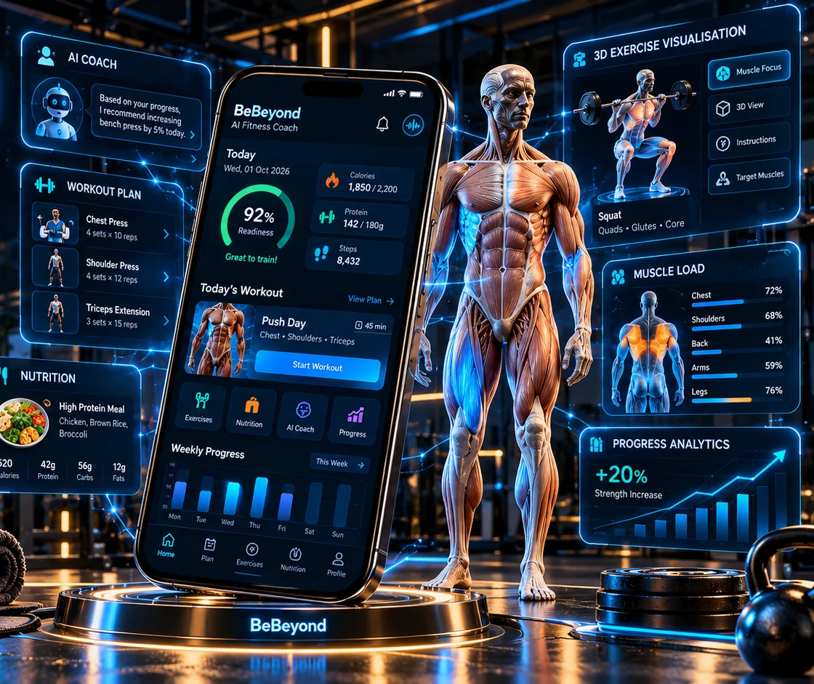
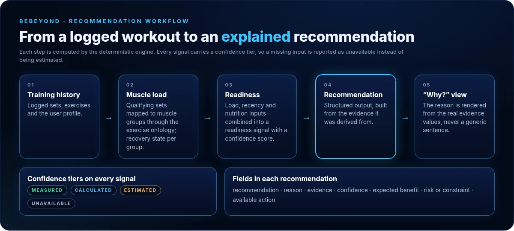
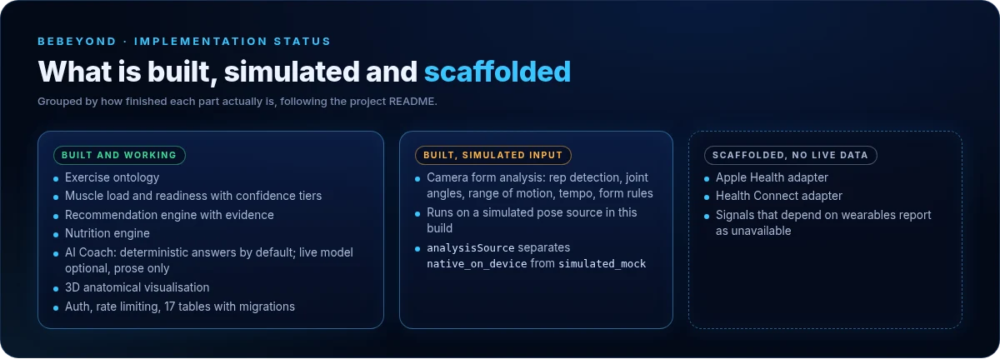

# BeBeyond: AI fitness and nutrition platform

**A training, nutrition and coaching app built on one rule: every recommendation must be able to explain exactly why it was made.**

Personal product · in active development · private repository · React Native (Expo) · FastAPI · PostgreSQL · Three.js

[← Back to profile](../../README.md) · [Portfolio](https://basant-kumar-portfoli.netlify.app/)

  
   Concept render. Screen values are illustrative, not real app data.

---

## The problem

Fitness apps either give generic plans or hand out confident-sounding numbers with no visible basis. Someone deciding whether to train hard today needs advice that reflects what they have actually done, says how certain it is, and admits when data is missing.

## Objective

Build one system for training, nutrition and coaching where:

- every number comes from a deterministic, testable engine;
- every recommendation carries the evidence behind it and a confidence tier;
- a language model can help explain a decision but can never change it.

## My contribution

I designed and built BeBeyond end to end as a personal product: the exercise ontology, the intelligence engines, the FastAPI backend, the data model and the React Native app.

## How it works

  

**The AI boundary.** The deterministic engine owns every number and every decision: readiness, accumulated load, nutrition targets, what to train next, confidence, and whether an action needs confirmation. A language model, if one is configured, may only write the prose that explains a decision.

- With no provider configured, the coach uses its deterministic fallback, and responses say so (`is_live_provider=False`).
- If a provider fails, the deterministic response is returned unchanged.
- The mobile app never calls a model provider directly. All generation happens on the server, which keeps API keys off the device.

### From a workout to a recommendation

  

1. **Training history.** Logged sets and exercises, plus the user profile.
2. **Muscle load.** The exercise ontology maps qualifying sets to muscle groups, and the recovery state of each group is estimated.
3. **Readiness.** Load, recency and nutrition inputs combine into a readiness signal with a confidence score.
4. **Recommendation.** A structured output with the recommendation, its reason, the evidence, confidence, expected benefit, risk or constraint, and the available action.
5. **Explanation.** The "Why?" view renders the reason from the real evidence values, never a generic sentence.

Every signal carries a confidence tier: `measured`, `calculated`, `estimated` or `unavailable`. A missing input is reported as unavailable rather than guessed, because a plausible-looking readiness figure is worse than a blank one.

## What is built, and what is not

  

| Status | Features |
|---|---|
| **Built and working** | Exercise ontology · muscle load and readiness with confidence tiers · recommendation engine · nutrition engine · AI coach (deterministic by default) · 3D anatomical view · authentication with session revocation, rate limiting, 17 tables with versioned migrations |
| **Built, running on simulated input** | Camera form analysis: rep detection, joint angles, range of motion, tempo and form rules are implemented and tested, but run against a simulated pose source. An `analysisSource` field separates `native_on_device` from `simulated_mock`, so simulated output cannot be shown as real analysis. |
| **Scaffolded, no live data** | Apple Health and Health Connect adapters. Signals that depend on them report as unavailable. |

## Technology

| Layer | Technology | What it contributes |
|---|---|---|
| Mobile | React Native, Expo, Expo Router, TypeScript | Cross-platform app and navigation |
| Mobile | Zustand | Client state |
| Mobile | Three.js, React Three Fiber, expo-gl | 3D anatomical visualisation |
| Backend | Python, FastAPI, Pydantic | API and the deterministic intelligence engines |
| Data | PostgreSQL, SQLAlchemy, Alembic | 17 tables with versioned migrations |
| Quality | pytest, mobile test suite | 35 backend and 71 mobile test files covering the engines, the AI provider boundary, authentication and exercise data |

## Results and limitations

- **In active development.** It is a personal product, not a production-ready release.
- Camera form analysis has no on-device pose provider in this build. Real-time pose needs a frame-processor camera stack that conflicts with a dependency the app already uses.
- Wearable integrations are scaffolding only.
- Live language-model explanations are off unless a provider is configured.
- There are no app screenshots here yet. The image at the top is a concept render, and the diagrams are drawn from the codebase.

## Code

The repository is private while the product is in development, so this page is the public write-up.

---

[← Back to profile](../../README.md) · [Portfolio](https://basant-kumar-portfoli.netlify.app/) · [LinkedIn](https://www.linkedin.com/in/basantsingh-/)
