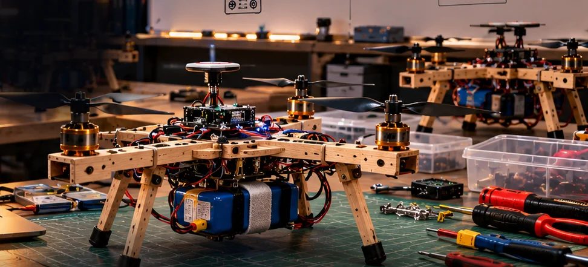
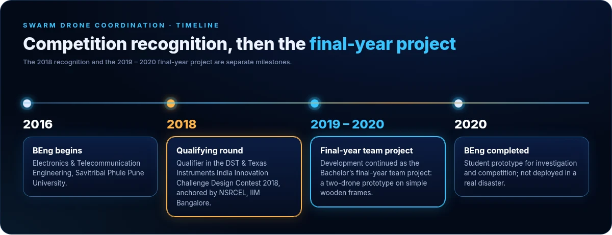
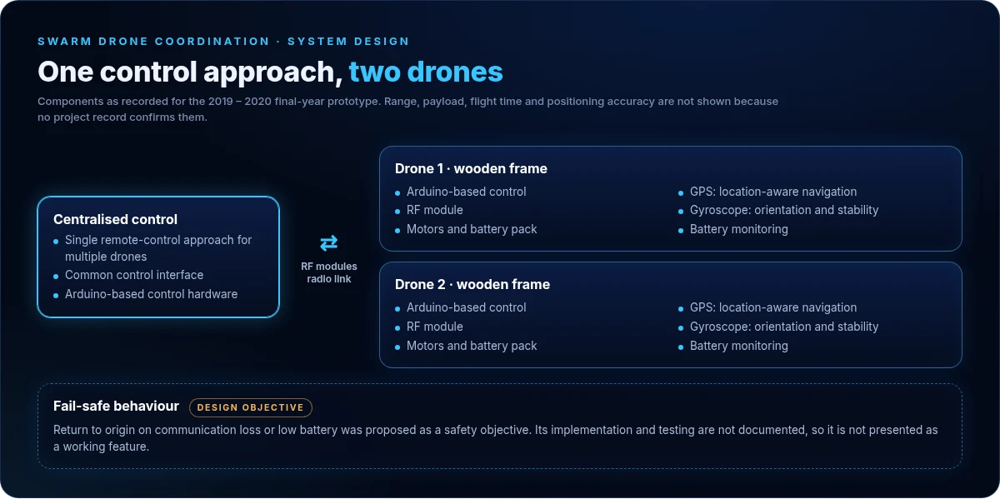
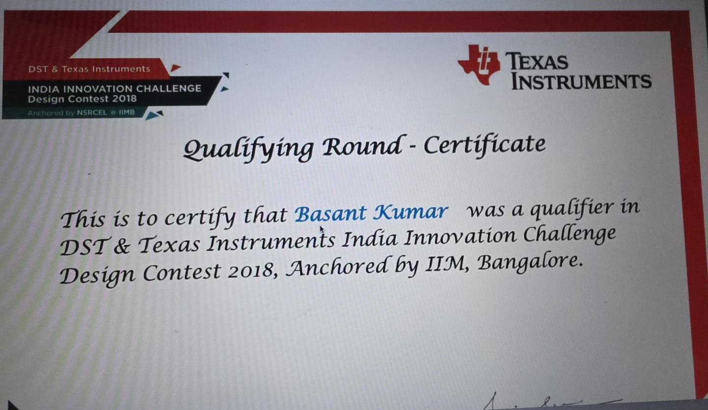
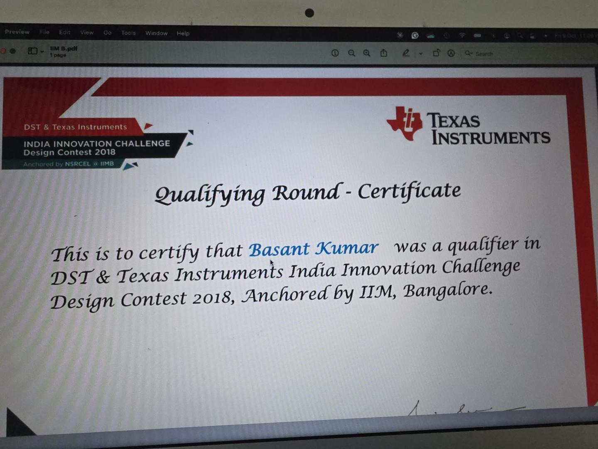

# Swarm Drone Coordination: a multi-drone system for disaster response

**A Bachelor's engineering team project exploring how two drones could be coordinated through one control approach to support emergency response.**

BEng Electronics & Telecommunication Engineering, Savitribai Phule Pune University · 2018 – 2020 · Arduino · GPS · gyroscope · RF modules

[← Back to profile](../../README.md) · [Portfolio](https://basant-kumar-portfoli.netlify.app/)

  
   Concept render of the two wooden-frame drones. Not a photograph of the prototype.

---

## The problem

Disaster zones can be hard to reach: difficult terrain, cut-off locations and the need to get essential supplies where they are needed quickly. Flying several drones normally means one pilot per drone.

## Objective

Explore a multi-drone coordination concept for disaster response, such as supply delivery and search-and-rescue support, built around a single, centralised remote-control approach.

## My contribution

I was a member of the final-year engineering team that developed the project. The surviving project record describes the team's work as a whole and does not separate individual responsibilities, so none are claimed here.

## Timeline

  

| When | Milestone |
|---|---|
| **2018** | Qualifier in the **qualifying round** of the DST & Texas Instruments India Innovation Challenge Design Contest 2018, anchored by NSRCEL, IIM Bangalore |
| **2019 – 2020** | Development continued as the **Bachelor's final-year team project**, with a two-drone prototype on simple wooden frames |

The 2018 recognition was at qualifying-round level. It is not a finalist or winner placing.

## How it works

  

| Component | Role in the system |
|---|---|
| Centralised control | One remote-control approach to manage several drones through a common interface, on Arduino-based control hardware |
| RF modules | Radio link between the control side and the drones |
| GPS | Location information for navigation and location-aware operation |
| Gyroscope | Orientation sensing for stable movement and control |
| Battery monitoring | Watching battery state so that a drone is not lost mid-task |
| Fail-safe *(design objective)* | Return to origin on communication loss or low battery was proposed. Its implementation and testing are not documented. |

**Engineering challenges the design addressed:** coordinating several aircraft through one control approach, navigation and orientation, battery and operating conditions, and safe behaviour on failure.

## Specification

| Item | Detail |
|---|---|
| Project type | Student engineering prototype; Bachelor's final-year team project |
| Drones | Two |
| Frame | Simple wooden frame |
| Control | Centralised remote-control concept; Arduino-based control hardware |
| Communication | RF modules |
| Navigation and orientation | GPS and gyroscope |
| Power | Battery packs with battery monitoring |
| Application | Disaster response: supply delivery, search-and-rescue support |

Range, payload, flight time and positioning accuracy are not listed because no project record confirms them.

## Evidence

<table>
<tr>
<td width="50%" valign="top"></td>
<td width="50%" valign="top"></td>
</tr>
</table>
Qualifying-round certificate, India Innovation Challenge Design Contest 2018 (left), and the original photograph of it (right).

## Results and limitations

- A student prototype built for investigation and competition. It was not deployed in a real disaster.
- No flight logs, telemetry or test results survive in the project record, so none are reported.
- No photographs of the physical prototype are available; the image at the top is a concept render.

## What I took from it

The project taught me how hardware, navigation, monitoring and control have to work together to solve a practical problem. That systems view still shapes how I approach analytics and product work.

---

[← Back to profile](../../README.md) · [Portfolio](https://basant-kumar-portfoli.netlify.app/) · [LinkedIn](https://www.linkedin.com/in/basantsingh-/)
